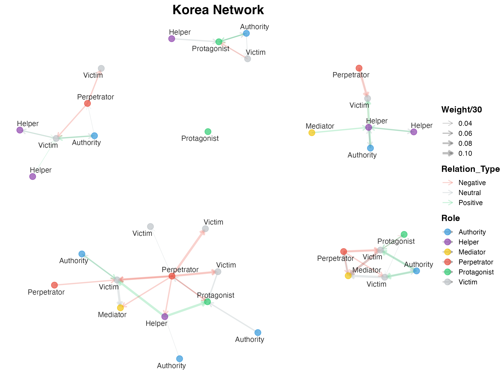
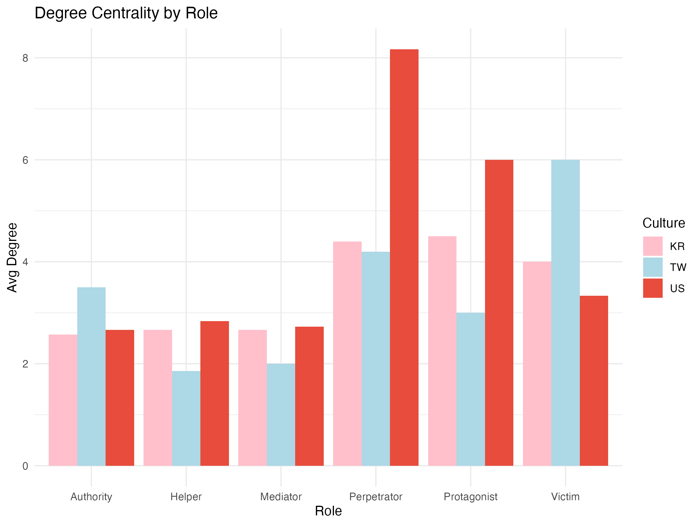

# Who Saves You from the Ghost? Narrative Roles in Taiwanese, Korean and American Ghost Stories

A course project (KAIST, Fall 2025, Statistical Analysis of Social Network Data). I annotated 15 first-person ghost stories as character networks and compared who restores order after a haunting in Taiwan, Korea and the US.


*One annotated Korean story as a network: characters are nodes, interactions are edges.*

**In short**
- 15 ghost stories (5 each from Taiwan, Korea, the US), annotated by hand into 110 characters and 204 relations, split into three story stages.
- Taiwan relies on authority figures, Korea on mediators who connect people, and the US on the victim acting alone.
- Fifteen stories show patterns to explore, not proof about a culture.

## Problem
Ghost stories posted online as real experiences record what people actually did: whom they asked for help, what failed and what worked. Folklore studies usually count motifs or topics. I wanted to ask the question from the other side, using network structure: in each culture, who holds the power to solve the problem, and does that change as the story unfolds?

## My role
I built the corpus and chose the stories. I annotated every character and relationship by hand. I designed the three-stage network approach and ran the analysis in R. I also wrote the paper and poster, and presented it in a 3-minute English talk. The professor and TAs scored the class projects, and this one ranked 1st among 10+. I used Claude Code as a coding assistant.

## Data
- Source corpus: ghost-experience posts from PTT (15,759), TheQoo (967) and Reddit (5,667).
- Keyword filter for stories that include a resolution step (spirit medium, priest, exorcist and similar terms, with a culture-specific list for each platform).
- Five random stories per platform, 15 in total, annotated by hand: `data/node_list.csv` (110 characters, with role, gender, species and culture) and `data/edge_list.csv` (204 relations, each with type, weight, stage and a memo).
- Narrative roles include protagonist, victim, perpetrator, authority, mediator and helper. Each story is split into three stages.

The raw posts are not published. Only my annotations are in `data/`.

## Tools
R (igraph, ggraph, tidyverse, patchwork, ggplot2) in a single R Markdown file, `analysis.Rmd`.

## Process
1. Filter the corpus by culture-specific keywords, sample five stories per platform.
2. Annotate characters (nodes) and interactions (edges: positive, neutral or negative), stage by stage.
3. Build one network per culture and per stage.
4. Compare centrality by role (degree, in-degree, betweenness, eigenvector) across stages, and look at role-to-role interaction patterns.

## Key insights
- Taiwan: authority figures dominate, especially in stages 2 and 3. People trust an authority to restore order.
- Korea: mediators carry information and connect roles, especially in the later stage, while authority still matters.
- US: authority has little influence. Stories center on the victim, who often handles it alone (sage, salt), and on conflict with the perpetrator.



## Business impact
This is an academic project with no deployment. The transferable skill is turning unstructured text into a labeled network and comparing groups by structure rather than by keywords, which applies to customer-journey and support-conversation analysis.

## Challenges and learnings
- Fifteen stories are too few for statistical claims. My course paper treats the results as patterns to explore, not as proof about each culture.
- TheQoo has many more female users, so the Korean stories may lean toward women's experiences. My course paper names this as its main limit.
- Annotation was done by one person (me). A second annotator and agreement scores would make it stronger. My course paper suggests few-shot LLM annotation to scale up.
- Stage-based slicing is coarse. A finer timeline would show dynamics better.

## Run it
```r
install.packages(c("igraph","tidyverse","ggraph","gridExtra","patchwork","forcats"))
rmarkdown::render("analysis.Rmd")
```
The notebook reads `data/node_list.csv` and `data/edge_list.csv`.

## License
MIT. See `LICENSE`.
